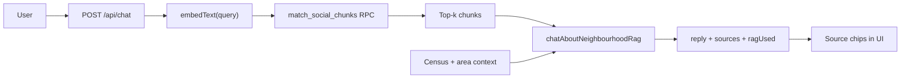

# Social Pulse RAG

> **Status:** Implemented  
> **Last updated:** July 2026

Neighbourhood chat is augmented with **retrieval-augmented generation (RAG)** over real community posts (Reddit and local news). When a user asks a question, the latest message is embedded, matched against stored post chunks in Supabase pgvector, and the top excerpts are passed to the LLM with citation instructions.

---

## Architecture



### Data flow

1. **Ingest** (`npm run ingest:social`) fetches posts per demo neighbourhood, chunks title + body (~2000 chars with overlap), embeds with OpenAI `text-embedding-3-small` (1536 dims), and upserts into `social_posts` / `social_post_chunks`.
2. **Retrieval** (`retrieveSocialChunks` in `src/lib/social-rag.ts`) embeds the user's latest message and calls the `match_social_chunks` RPC, filtered by `geoid` with a city/county fallback when geoid data is sparse.
3. **Generation** (`chatAboutNeighbourhoodRag` in `src/lib/ai.ts`) adds a numbered **Community posts** section to the system prompt and instructs the model to cite sources as `[1]`, `[2]`, etc.
4. **UI** (`ChatPanel`) shows a "Grounded in community posts" badge and clickable source chips under assistant replies.

---

## Before vs after

| | Before | After (RAG) |
|---|--------|-------------|
| Community context | Static mock `socialSentiment` keywords in JSON context | Live retrieved post excerpts |
| Citations | None | Inline `[1]` references + source chips |
| Fallback | N/A | Works without ingest or OpenAI key (non-RAG path) |

### Example

**Question:** "What do residents say about schools in Niles?"

**Retrieved chunks (abbreviated):**

- `[1] (r/bayarea): Parents in Niles mention Irvington High as a draw…`
- `[2] (r/fremont): Discussion of elementary options near Mission San Jose…`

**Answer (excerpt):** "Residents often mention school quality as a reason to live in Niles [1], with particular interest in nearby high schools [2]. …"

The chat panel shows source chips linking to the original Reddit posts.

---

## Setup

### Environment

| Variable | Purpose |
|----------|---------|
| `OPENAI_API_KEY` | Embeddings + chat |
| `NEXT_PUBLIC_SUPABASE_URL` | Supabase project URL |
| `SUPABASE_SERVICE_ROLE_KEY` | Ingest writes + RPC search from API |

Reddit OAuth is optional; ingest and Social Pulse fall back to RSS/Google News when Reddit credentials are absent.

### Database migration

Apply `supabase/migrations/004_social_rag.sql` to your Supabase project. If pgvector is not enabled, run `create extension vector` in the Supabase SQL editor first.

### Ingest demo neighbourhoods

```bash
npm run ingest:social
```

This processes ~12 curated Bay Area neighbourhoods (match catalog + demo geoids). Expect output like:

```
→ Niles Fremont, Alameda County (06001440100)
  Fetched 25 posts → upserted 25, 31 chunks
```

Re-run periodically to refresh posts.

---

## Verification checklist

1. Migration applied; `social_posts` and `social_post_chunks` tables exist.
2. `npm run ingest:social` completes without errors and rows appear in Supabase.
3. `npx tsx scripts/verify-social-rag.ts` retrieves chunks and generates a RAG reply (optional smoke test).
4. `npm run build` passes.
5. Open Explore → select an ingested area → open chat.
6. Ask: *"What do residents say about schools?"*
7. Confirm the reply cites `[1]`, `[2]`, shows the RAG badge, and source chips link to posts.
8. Select an area with no ingest → chat still works (no sources, `ragUsed: false`).

### API response shape

```json
{
  "reply": "Residents mention… [1]",
  "sources": [
    {
      "index": 1,
      "source": "r/bayarea",
      "excerpt": "Parents in Niles mention…",
      "permalink": "https://reddit.com/…",
      "similarity": 0.82
    }
  ],
  "ragUsed": true
}
```

---

## Key files

| File | Role |
|------|------|
| `supabase/migrations/004_social_rag.sql` | pgvector tables + `match_social_chunks` RPC |
| `src/lib/embeddings.ts` | OpenAI embedding helpers |
| `src/lib/social-rag.ts` | Chunking, ingest, retrieval |
| `scripts/ingest-social-embeddings.ts` | Demo neighbourhood ingest script |
| `src/app/api/chat/route.ts` | Wires retrieval into chat API |
| `src/lib/ai.ts` | `chatAboutNeighbourhoodRag` with citation prompt |
| `src/components/chat/ChatPanel.tsx` | Source chips + RAG badge |

---

## Out of scope (v1)

- Streaming chat tokens
- Vector search over user house notes
- Full Bay Area ingest (expand after demo neighbourhoods work)
- External vector DB (Supabase pgvector only)
